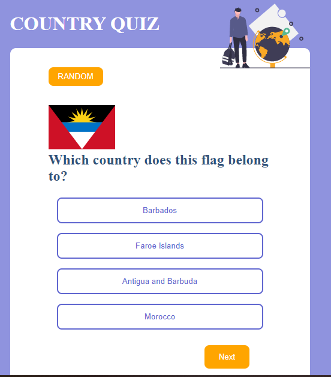
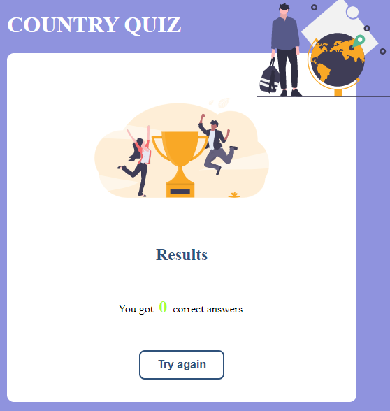

# Country Quiz

## Table of Contents

-   [Overview](#overview)
    -   [Built With](#built-with)
-   [What I did](#what-I-did)
-   [How does it work](#how-does-it-work)
-   [Contact](#contact)

<!-- OVERVIEW -->

## Overview




### Built With

-   [React](https://reactjs.org/)

## What I did

In this project, I work with react to create a country quiz app. There are quite lots of features in this project and it contains a few files. There is the GetRandomCountry.js file where you can find the code for getting the random countries for the answer and also for tha question. This quiz contains two questions, capital city and a flag which is belonging to a country. The Result.js file is a file where you can see the number of correct answer you get.

## How does it work

To start the game, there is a random button that you have to click to get the flag and all the choices that are formed as buttons. When you get the right answer the button's background will change into green and if it is wrong it is going to be red. The next button is to get the next question if your answer is correct, but if your answer is wrong it brings you to the result page to see how many correct answers you have got.

## How To Use

<!-- Example: -->

To clone and run this application, you'll need [Git](https://git-scm.com) and [Node.js](https://nodejs.org/en/download/) (which comes with [npm](http://npmjs.com)) installed on your computer. From your command line:

```bash
# Clone this repository
$ git clone https://github.com/your-user-name/your-project-name

# Install dependencies
$ npm install

# Run the app
$ npm start
```

## Contact

-   Website [your-website.com](https://{your-web-site-link})
-   GitHub [@Mickaella](https://github.com/Mickaellah/country-quiz)

